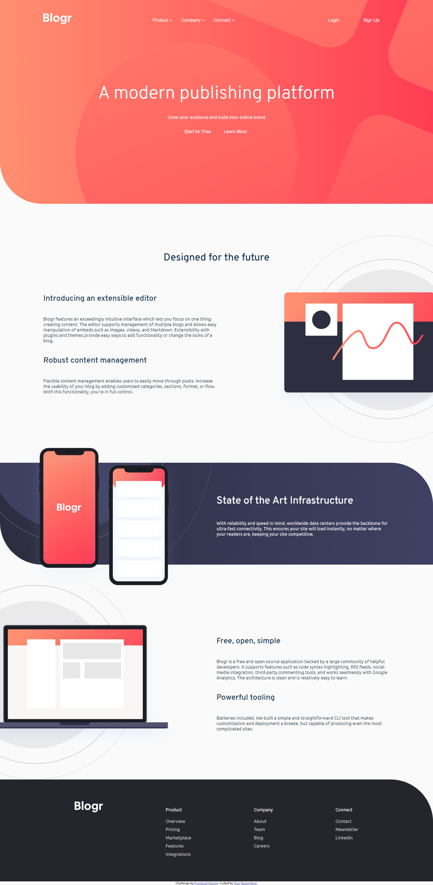
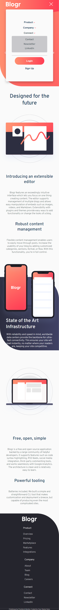

# Frontend Mentor - Blogr landing page solution

This is a solution to the [Blogr landing page challenge on Frontend Mentor](https://www.frontendmentor.io/challenges/blogr-landing-page-EX2RLAApP). Frontend Mentor challenges help you improve your coding skills by building realistic projects. 

## Table of contents

- [Overview](#overview)
  - [The challenge](#the-challenge)
  - [Screenshot](#screenshot)
  - [Links](#links)
- [My process](#my-process)
  - [Built with](#built-with)
  - [What I learned](#what-i-learned)
  - [Continued development](#continued-development)
  - [Useful resources](#useful-resources)
- [Author](#author)
- [Acknowledgments](#acknowledgments)

## Overview

### The challenge

Users should be able to:

- View the optimal layout for the site depending on their device's screen size
- See hover states for all interactive elements on the page

### Screenshot




### Links

- Solution URL: [](https://steppenhasen.github.io/FrontEnd-Exercises/blogr-landing-page-main/index.html)
- Live Site URL: [](https://github.com/SteppenHasen/FrontEnd-Exercises/tree/main/blogr-landing-page-main)

## My process
It was already a familiar process of writing a landing page. I worked with flexbox, deciding not to load the page. Also this time I used more javascript instead of css events.

### Built with

- Semantic HTML5 markup
- CSS custom properties
- Flexbox
- Mobile-first workflow

### What I learned

```html
I have better understanding of markups logic
```
```css
Proud of knowing how to use background-image and gradients
```
```js
Look at Function hover, Its's new way for me to change display settings
Also now I know how to use for cycle with document's elements
}
```

## Author

- Website - [](https://unsplash.com/@corpease)
- Frontend Mentor - [](https://www.frontendmentor.io/profile/SteppenHasen)
- Twitter - [](https://twitter.com/steppen_hasen)
