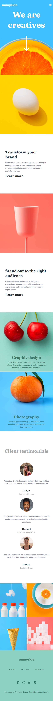
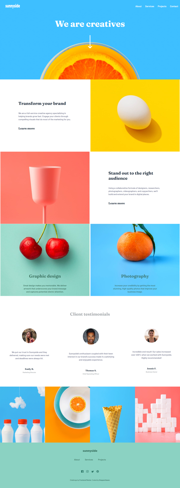

# Frontend Mentor - Sunnyside agency landing page solution

## Overview
So, this is landing page for website, made clearlyy with HTML and CSS

### The challenge

Users should be able to:

- View the optimal layout for the site depending on their device's screen size
- See hover states for all interactive elements on the page

### Screenshot

### Links

- Solution URL: [solution URL](https://github.com/SteppenHasen/FrontEnd-Exercises/tree/main/sunnyside-agency-landing-page-main)
- Live Site URL: [live site URL](https://steppenhasen.github.io/FrontEnd-Exercises/sunnyside-agency-landing-page-main/index.html)

## My process

### Built with

- Semantic HTML5 markup
- CSS custom properties
- Flexbox
- CSS Grid

### What I learned

I've learned how to work with CSS Grid and @media querry

## Author
- Frontend Mentor - [@SteppenHasen](https://www.frontendmentor.io/profile/SteppenHasen)

