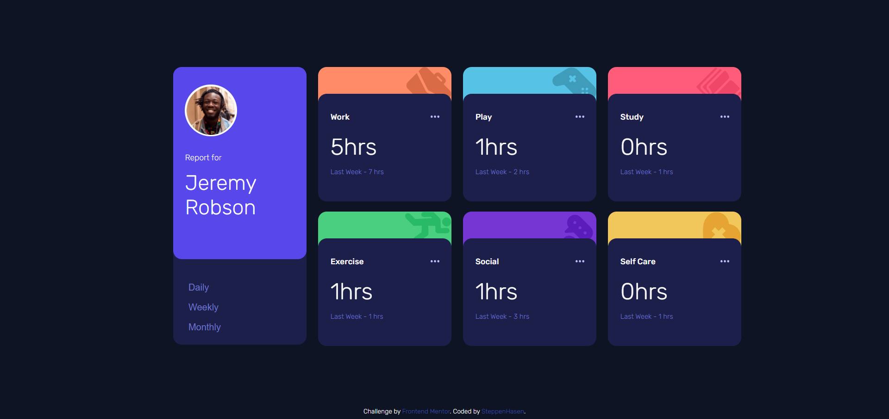
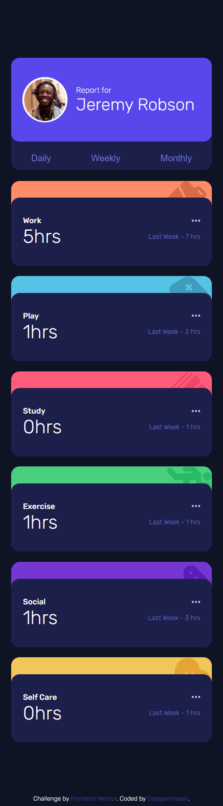

# Frontend Mentor - Time tracking dashboard solution

This is a solution to the [Time tracking dashboard challenge on Frontend Mentor](https://www.frontendmentor.io/challenges/time-tracking-dashboard-UIQ7167Jw). Frontend Mentor challenges help you improve your coding skills by building realistic projects. 

## Table of contents

- [Overview](#overview)
  - [The challenge](#the-challenge)
  - [Screenshot](#screenshot)
  - [Links](#links)
- [My process](#my-process)
  - [Built with](#built-with)
  - [What I learned](#what-i-learned)
- [Author](#author)

## Overview

### The challenge

Users should be able to:

- View the optimal layout for the site depending on their device's screen size
- See hover states for all interactive elements on the page
- Switch between viewing Daily, Weekly, and Monthly stats

### Screenshot

### Links

- Solution URL: [solution URL](https://github.com/SteppenHasen/FrontEnd-Exercises/tree/main/time-tracking-dashboard-main)
- Live Site URL: [live site URL](https://steppenhasen.github.io/FrontEnd-Exercises/time-tracking-dashboard-main/index.html)

## My process

### Built with

- Semantic HTML5 markup
- CSS custom properties
- Flexbox
- CSS Grid
- Mobile-first workflow
- Pure JS & DOM for making info-boxes

### What I learned
The most important work, that I did is with JSON and JS for making auto-creation of informaition boxes according to data from JSON file.

## Author

- Frontend Mentor - [@SteppenHasen](https://www.frontendmentor.io/profile/SteppenHasen)
